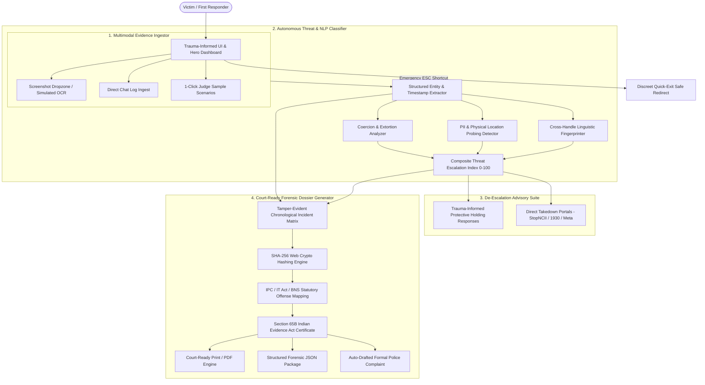

# 🛡️ SentinelHer (SafePersona)
### Autonomous Digital Harassment Interceptor & Forensic Dossier Engine

> **A Trauma-Informed, Zero-Knowledge Defense System for Women Facing Coercive Cyberstalking, Burner Impersonation, and Synthetic Deepfake Extortion.**

[-indigo.svg)](#legal-framework--court-admissibility)
[-cyan.svg)](#judge-evaluation--testing-guide)

---

## 📌 1. Executive Summary & Problem Statement

Digital harassment, non-consensual deepfake extortion, and persistent cyberstalking against women have reached crisis proportions globally. When targeted, victims face three systemic barriers:

1. **The "Burner Account Paradox"**: Stalkers evade blocks by creating disposable handles across Instagram, Telegram, WhatsApp, and LinkedIn. Victims possess fragmented, unorganized screenshots that police and platforms dismiss as "isolated disputes."
2. **The Panic Retaliation Trap**: In moments of terror, victims often plead, negotiate, or react angrily—reactions that either fuel volatile stalkers or weaken legal standing during prosecution.
3. **Evidence Inadmissibility**: Standard screenshots without cryptographic hashes, metadata, and timestamps frequently fail court admissibility standards under **Section 65B of the Indian Evidence Act** or **US Federal Rules of Evidence 902(14)**.

**SentinelHer (SafePersona)** solves these challenges autonomously. It functions as an intelligent intermediary that ingests multimodal harassment evidence, unmasks burner accounts through linguistic fingerprinting, provides trauma-informed de-escalation "holding responses", and instantly compiles court-admissible forensic dossiers with SHA-256 chain-of-custody verification.

---

## 🏗️ 2. High-Level System Architecture

---

## 🚀 3. Core Architectural Modules

### 1. Trauma-Informed Triage Dashboard & Discreet Quick-Exit
- **Calming Slate Palette**: Designed specifically for high-stress situations using soothing dark slate tones, preventing sensory overload while providing clear threat cues.
- **Discreet Quick-Exit Protocol**: A prominent top banner button and an instant `Esc` keyboard shortcut immediately purge transient screen state and redirect the window to `news.google.com` or `weather.com`.
- **Live Triage Metrics**: Real-time display of composite threat severity (0-100), active monitored incidents, cross-handle correlation confidence, and cryptographically hashed assets.

### 2. Multimodal Incident Ingestion & Extraction Engine
- **Screenshot Dropzone**: Accepts image captures (Instagram DMs, Telegram, WhatsApp, X, LinkedIn) with animated OCR scanning.
- **Direct Chat Log Parsing**: Allows arbitrary text log ingestion with sender handles and platform metadata.
- **Pre-Loaded Hackathon Scenarios**: 3 pre-packaged realistic cases so judges can test with a single click.

### 3. Autonomous Threat & Escalation Classifier
- **Coercion & Extortion Scoring**: Scans for financial demands (crypto/cash), non-consensual deepfake blackmail, countdown deadlines, and reputational injury threats.
- **Linguistic Fingerprinting across Burner Accounts**: Detects syntax fingerprints, idiosyncratic punctuation (e.g. `!!...`), recurrent typos (e.g. `definetly`), and phrasing habits across distinct usernames to expose when multiple burners are operated by the same stalker.
- **Geolocation & Physical Probing Detection**: Identifies references to residential addresses, offices, gym routines, and vehicle registration numbers.

### 4. De-Escalation & Safety Advisory Agent (SafePersona)
- **Neutral, Legally Protective Holding Responses**:
  - *Written Revocation of Consent*: Explicitly revokes consent and establishes a timestamped paper trail required by cyberstalking statutes.
  - *Strategic Delay / Non-Escalatory Stall*: Acknowledges communication neutrally without escalating panic, buying crucial time for police response during timed ultimatums.
  - *Third-Party Representation Stance*: Depersonalizes the interaction, shifting communication to legal counsel and removing the stalker’s psychological reward.
- **Direct Takedown Workflows**:
  - **StopNCII.org Protocol**: Guidance for non-reversible hash generation preventing synthetic/real intimate image dissemination across Meta, TikTok, OnlyFans, and Reddit.
  - **National Cybercrime Portal (1930 / cybercrime.gov.in)**: Automated police complaint generator tailored to the active case.

### 5. Court-Ready Forensic Dossier Engine
- **Tamper-Evident Chronological Incident Matrix**: Every individual message is cryptographically fingerprinted with an individual SHA-256 hash.
- **Master Chain-of-Custody Digest**: Ingests all message hashes to generate a single master SHA-256 digest.
- **Statutory Certificate of Admissibility**: Formatted under **Section 65B of the Indian Evidence Act, 1872** / **Section 63 of Bharatiya Sakshya Adhiniyam, 2023** / **US Federal Rules of Evidence 902(14)**.
- **Standardized Print-to-PDF Media**: Clean `@media print` CSS formats an official court affidavit with high-contrast legal frames, hiding all non-dossier UI components.

---

## ⚖️ 4. Legal Framework & Statutory Mapping

SentinelHer maps harassment patterns to concrete statutes under Indian Law and international conventions:

| Offense Description | Statutory Provision | Applicable Penalties |
| :--- | :--- | :--- |
| **Cyberstalking & Persistent Surveillance** | Section 354D IPC / Section 78 BNS | Imprisonment up to 3 years (first) or 5 years (subsequent) + fine. Cognizable & Non-Bailable. |
| **Violation of Bodily Privacy (Deepfakes/Intimate Photos)** | Section 66E Information Technology Act 2000 | Imprisonment up to 3 years or fine up to ₹2,00,000, or both. |
| **Transmitting Sexually Explicit / Obscene Digital Media** | Section 67 & 67A Information Technology Act 2000 | Imprisonment up to 5 years (first) / 7 years (subsequent) and fine up to ₹10,00,000. |
| **Extortion & Coercive Blackmail** | Section 383 & 384 IPC / Section 308 BNS | Imprisonment up to 3 years, or with fine, or both. |
| **Criminal Intimidation** | Section 503 & 506 IPC / Section 351 BNS | Imprisonment up to 7 years or fine, or both (when threatening reputational injury). |
| **Insult to the Modesty of a Woman** | Section 509 IPC / Section 79 BNS | Simple imprisonment up to 3 years and with fine. |

---

## 🔒 5. Privacy & Zero-Knowledge Guarantee

Victim safety is compromised when sensitive evidence is uploaded to unverified third-party cloud backends. SentinelHer guarantees:
- **100% Client-Side In-Memory Execution**: No chat transcripts or screenshots ever leave the browser tab.
- **Native Web Crypto Hashing**: SHA-256 checksums are calculated using the browser's hardware-accelerated `crypto.subtle` API.
- **Zero Cloud API Dependencies**: The application runs completely offline without external API keys or third-party tracking.

---

## 🧪 6. Judge Evaluation & Testing Guide

Judges can test every feature instantly without any setup:

### Step 1: Open the Application
Double-click `index.html` in any modern web browser (Chrome, Edge, Firefox, Safari) or serve locally.

### Step 2: Test 1-Click Scenarios
In the **Multimodal Evidence Ingestion** section, click any of the 3 quick-test buttons:
1. **1. Coercive Doxxing**: Tests cross-platform stalking with home addresses, vehicle registration numbers, and burner account linking.
2. **2. Deepfake Blackmail**: Tests financial cryptocurrency extortion, 2-hour ultimatums, and synthetic media dissemination threats.
3. **3. Handle Probing**: Tests persistent unwanted contact across LinkedIn, Instagram, and Telegram with matching syntactic typos.

### Step 3: Inspect the Threat Classifier
Observe how the **Risk Escalation Gauge** dynamically updates, displaying:
- Composite threat index score
- Coercion, physical doxxing, and linguistic burner match percentages
- Statutory legal offense mapping cards with specific sections of the IPC and IT Act

### Step 4: Interact with SafePersona Holding Responses
- Review the 3 trauma-informed holding responses.
- Click **"Copy Holding Response"** to test clipboard integration and view the strategic rationale.

### Step 5: Test the Forensic Dossier & Export Options
- Scroll to the **Forensic Evidence Dossier** section.
- Click **"Export Court-Ready PDF (Print View)"**: Preview the official, monochrome legal affidavit formatted specifically for court filing.
- Click **"Download JSON Package"**: Downloads the raw, structured forensic JSON payload for cybercrime unit import.
- Click **"Copy Police Complaint"**: Copies a formal letter addressed to the Cyber Crime Cell / cybercrime.gov.in.

### Step 6: Test the "Discreet Quick-Exit"
- Click the red **"Discreet Quick-Exit"** button in the top banner (or press <kbd>Esc</kbd> on your keyboard).
- Notice how the application immediately wipes local screen state and redirects to Google News.

---

## 📁 7. File Deliverables

- `index.html`: Complete responsive HTML5 single-page application with trauma-informed styling, modal structures, and dashboard layout.
- `app.js`: Autonomous threat classification engine, cryptographic SHA-256 hasher, linguistic burner matcher, holding response generator, and export suite.
- `styles.css`: Tailwind styling enhancements, animations (radar pulses, OCR scanline), and court-ready print media stylesheet (`@media print`).
- `README.md`: Comprehensive system documentation, architectural diagrams, legal mappings, and judge evaluation guide.

---

*Built with empathy, cryptographic rigor, and unwavering commitment to digital safety.*
